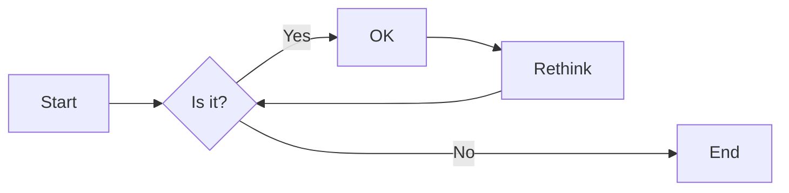

# flow.md

## Contents

This file will contain a diagram best showcasing the program

[mermaid tutorial](https://mermaid.js.org/config/Tutorials.html)

```mermaid
---
title
---
flowchart LR
    A[Start] --> B{Is it?}
    B -->|Yes| C[OK]
    C --> D[Rethink]
    D --> B
    B ---->|No| E[End]
```
